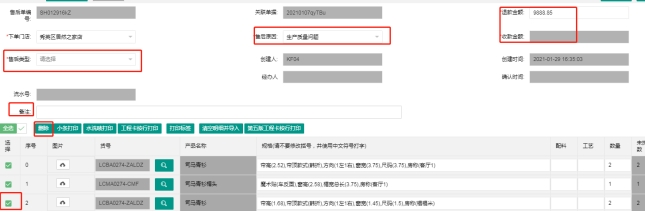
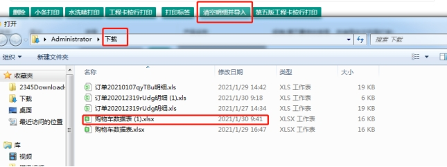
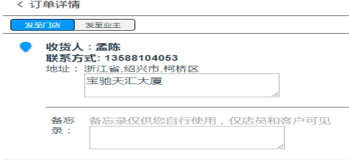
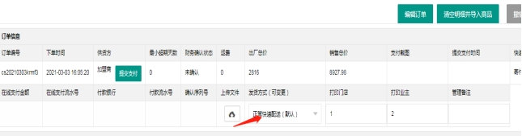
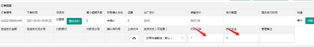
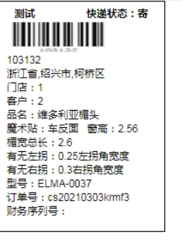

**1.原订单产品只是需要重新制作。**

实例：①、客户反馈产品有质量问题、面料问题重做；

②、补发产品问题；

③、做补款或者退款；

点击“销售管理”→所搜订单号→点击“创建售后”进入创建的售后订单；

删除无关产品，填写备注、售后原因金额（需要退款，在退款金额中填写，需要补款，将退款金额删除，在下方收款金额中填写）

点击保存→发至财务审核；

如图所示。

 

**2.需要重新商城中添加，导入售后单**。

实例：①、客户需退回产品修改尺寸高度；

②、因产品下架或无货换款；

③、其它原因需要更改工艺等；

打开商城→搜索产品→将产品信息和工艺添加到购物车中→点击“导出”

点击“销售管理”→所搜订单号→点击“创建售后”进入创建的售后订单；

点击“清空明细导入”

 

填写备注、售后原因及金额（需要退款，在退款金额中填写，需要补款，将退款金额删除，在下方收款金额中填写）点击保存→发至财务审核；

**3.订单补充说明：**

（1）发至门店或者业主

 

在修改订单时，可以选择修改地址；点击“销售管理”→所搜订单号→点击“订单号”→“编辑订单”

（2）发货方式变更

点击“销售管理”→所搜订单号→点击“订单号”→选择发货方式

 

（3）更改产品标签中的-门店名称或者客户名称

点击“销售管理”→所搜订单号→点击“订单号”→编辑所需要更改的门店名称或者客户名称。

 

所更改的效果如图

 

 

 