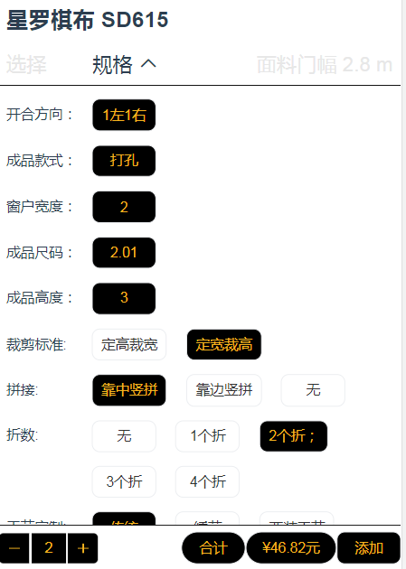

## 1.商城下单
1.1 点开客服提供的商城链接

1.2 可以通过“分类”寻找想要的商品

 

还可以通过搜索来寻找某款商品：通过输入中文、首字母键盘、型号等模糊搜索

 

1.3 找到需要下单的商品，选择需要的规格后添加到购物车。点击“合计”后会显示产品总价。

1.4 购物车查看下单的商品，确认无误后提交订单，该订单就会发送到总部

## 2.加盟商后台操作
### 2.1 修改未生产订单详情

### 2.2 查看历史订单记录及金额

### 2.3 查看订单生产进度

### 2.4 子账号

（1） 加盟商后台有子账号 ，**子账号 无法看到出厂价和统计信息** 

（2）子账号的账号，就是总账号加1  

比如 总账号 是13588888888 ，那子账号就是 135888888881

