## 1.1 新员工上岗培训要求
- 使用测试机，登入测试账号
- 熟练操作扫码计件
- 熟练操作扫码切换工艺
- 知道如何查询自己的产量

## 1.2 扫码记件
1. 工人扫工牌或者手动输入工号，平板会出现信息，证明此工人今天在这台机器上操作
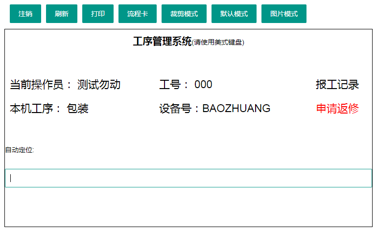

   

2.工人开始按工程卡排序，开始工作，当完成一张工程卡，将工程卡拿出来扫一下，出现以下提示，证明已经计件成功

3. **报错解决办法**

（1）当出现以下提示时，请联系车间管理人员，由管理人员将此设备在后台绑定工艺
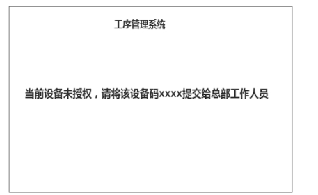 

（2） 当出现如图所示提醒时，说明已经被工号为“XXX”的计件，无法重新计算工资，如有异议请上报车间管理部门，管理人员调查原因后做更改

（3）当出现“订单不存在”，如图所示，请停止加工，上报车间管理部门

 

>[!TIP]
包装工序可以自动打印标签: 假如本机工序是"包装"，记件扫描明细码后自动打印产品标签（扫一次打印一次，明细码不存在的就不打印）
## 1.3 平板记件查询

1. 点击“**报工记录**”按钮 
    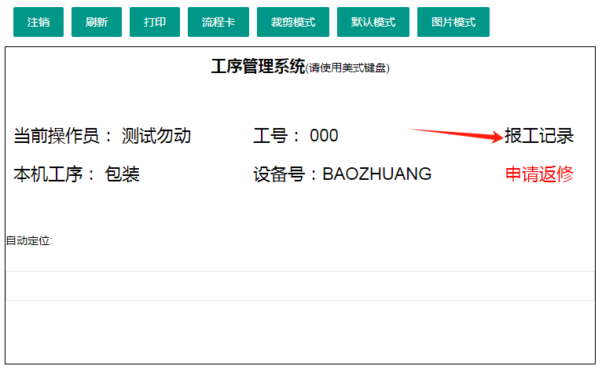

2. 点击对应工人姓名后，即可查询该工人当日记件明细、时间和工资
   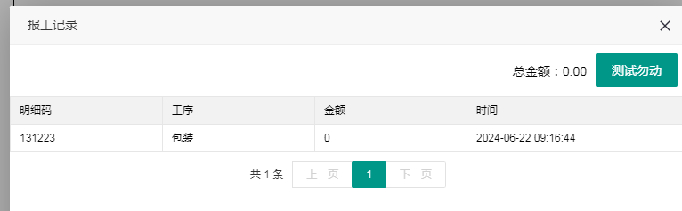

## 1.4 PC记件查询
### 1.4.1 查询工人或者工艺

点击“生产管理”→“记件管理”→查询记件信息→点击搜索

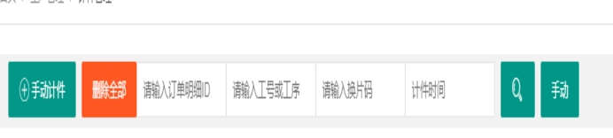 

输入工人工号或者工艺，查询此工人或工艺计件情况

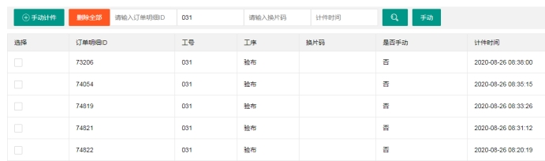 

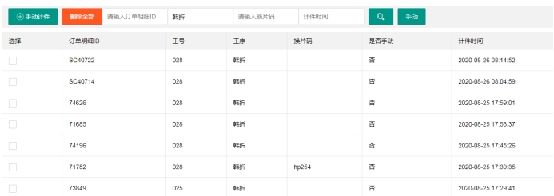 

### 1.4.2 查询订单进度

点击“生产管理”→“记件管理”→查询订单信息→点击搜索，输入订单明细码，查询此单进度

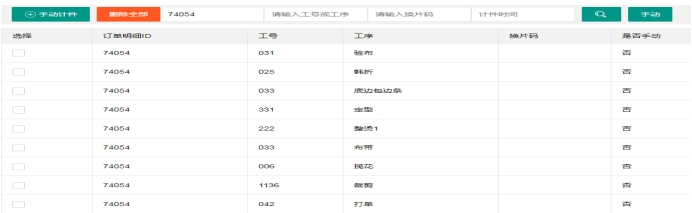

### 1.4.3 删除错误数据

点击“生产管理”→“记件管理”→查询记件信息→点击搜索，找到错误数据，选择单个删除

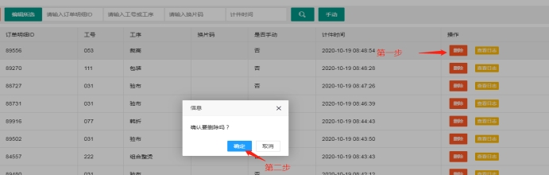 

找到错误数据，选择全部删除
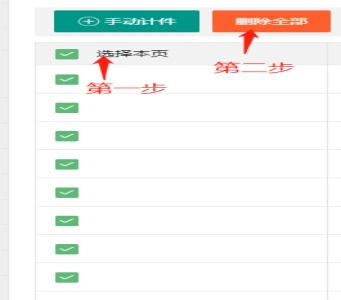 

 ### 1.4.4 更改错误数据

**(1) 批量更改工艺名称**

点击“生产管理”→“记件管理”→查询记件信息→点击搜索，找到错误数据，选择全部  →选择正确工艺名称

***注意***：适用于员工姓名、员工工号、明细码均不变的条件

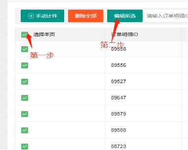 

**（2）更改单个计件信息**

点击“生产管理”→“记件管理”→查询记件信息→点击搜索，找到错误数据，选择单个信息 →手动计件→更改为正确信息→手动删除错误数据
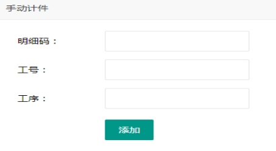 

## 1.5 手机记件

手机记件app下载地址：http://www.lcyjfz.com/upload/apk/cb/jj.apk

工人用手机浏览器搜索app下载地址，下载记件app“扫一扫”。

### 1.5.1 记件前准备
（针对每个工人都要进行这一步操作）：
假设编号000的工人，负责的是裁剪和拼接工序。我们需要为他创建一个二维码。 
在【**生产管理**】——【**工序管理**】 
1、勾选这个工人需要记件的工序。 
2、点击“打印二维码”。 
3、输入这个工人的工号。 
4、点击“生成二维码”。 
5、将生成的二维码保存下来，提供给编号000的这个工人。
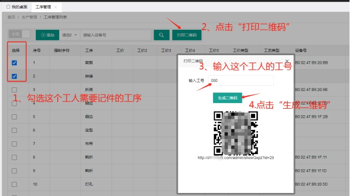 

### 1.5.2 记件操作

1、工人点开下载好的“扫一扫”app，第一次进入的页面是空白的，需要先【**配置系统**】

2、点【配置系统】，扫描经过“记件前准备”后获得的二维码。

3、配置完系统后，页面出现“记件前准备”生成二维码前勾选的两个工序。

4、点击工序后，去扫描流程卡条码，记件成功

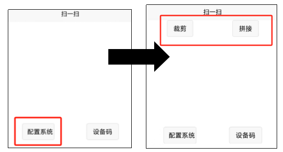