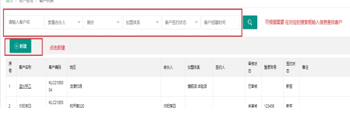
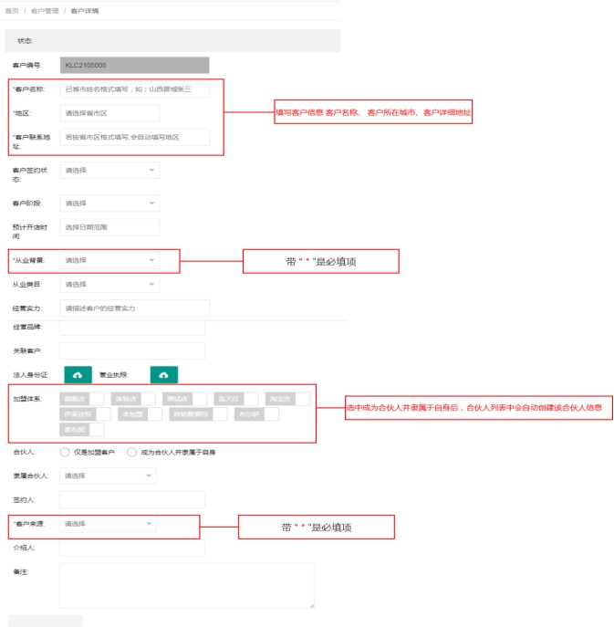
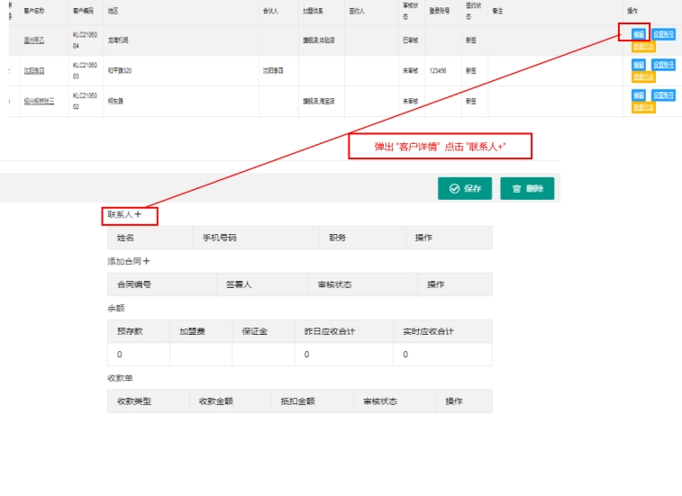
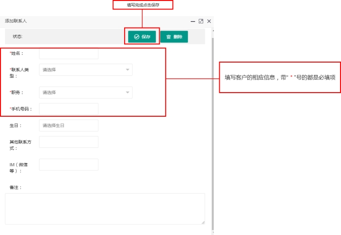
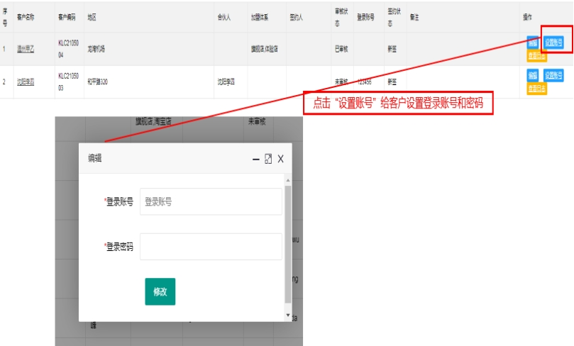
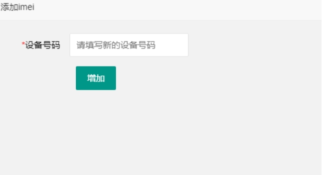
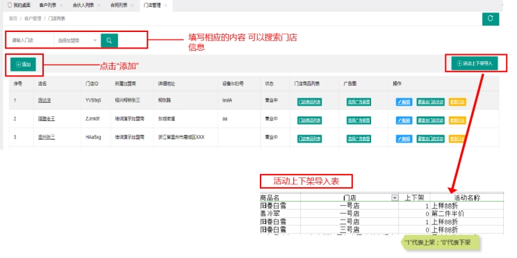
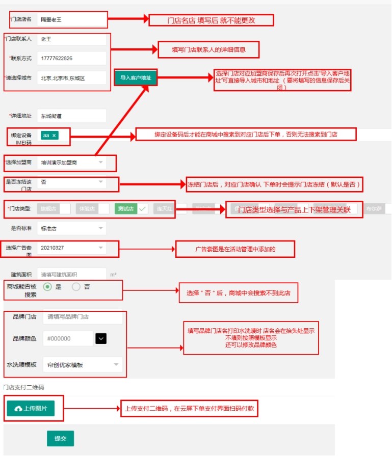

## 1.1客户信息上传
### 1.1.1创建客户
1.点击“客户管理”--------点击“客户列表”-----------点击“新建”

 

2. 弹出客户详情，在里面输入客户信息，填写完成后保存并关闭

 

3. 点击“编辑”，弹出“客户详情” --------点击“联系人+”

 

4. 填写客户相应的信息，点击“保存”

 

 ### 1.1.2设置加盟商后台账号密码  
1. 点击“设置账号”-------弹出“编辑”给客户设置登录账号和密码  ------填写完成点击“修改”

登录账号一般都是客户的手机号

 

## 1.2开通门店  

### 1.2.1添加设备码

1. 点击“客户管理”-----------点击“设备码管理”---------点击“添加” 输入设备码，点击“增加”

 

### 1.2.2添加门店

1. 点击“客户管理”-------点击“门店管理”---------点击“添加”

 

2. 点击“添加”弹出编辑后，开始填写门店信息

3. “门店名称”保存后是不能进行更改的

4. “导入客户地址”是需要将 带“ * ”的内容填写完成 选择相对应的加盟商 保存 关闭后，点击“编辑”重新进入后 才能出现的，这个时候就可以将客户地址导入了。

5. 绑定设备码：绑定设备码后才能在商城搜索到对应的门店后下单，否则无法搜索到门店

6. 商城能否被搜索：选择否后，商城无法搜索到此店，一般默认为“否”

7. 品牌门店、品牌颜色、水洗唛模板：填写品牌门店名打印水洗唛时 店名会在抬头处显示  不填则按照模板显示   还可以修改品牌颜色

 

 

 
 

 