## 2.1 产品创建

1、打开“批量导入商品”excel表格，填写需要上传的商品相关信息
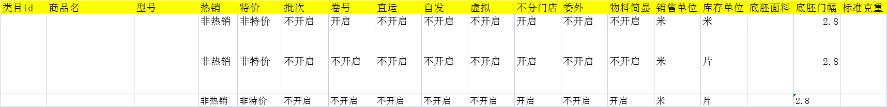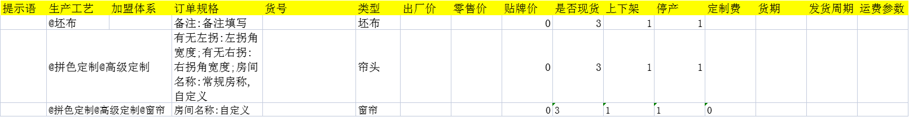

> [!TIP]（1）若字段在模板中已经有值，请不要修改这些数据 （2）使用“批量新增导入商品”按钮,只能导入一个货号，假如您的某个商品有多种可供选择的规格，那么这个新建商品的操作可能不是您最好的选择。

2、在 “**存货档案列表**”——点击“**批量新增导入商品**” 选择保存的表格，进行导入操作。

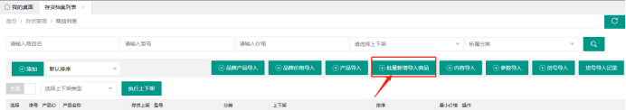

3、导入成功后点开新增的窗帘页面。

（1）主图是系统默认图片，可修改。

> [!TIP]图片大小建议1080*1340，即宽1080 高1340，这样比较契合系统，
> 如果图片是比较宽的图，建议上下留白，或者左右适当切割。 图片不对齐将会影响商城美感

（2）如果类型填了“窗帘”，保存后商品的货号规格如下图所示：

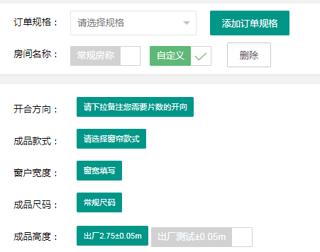

4、上架商品   
由于客户无法在商城中搜索到尚未上架的商品，所以产品信息员上传商品后，务必记得将**商品上架**。

（1）单个商品上架

每一个商品后都有“上架”“下架”按钮，点击后即可进行对应操作。

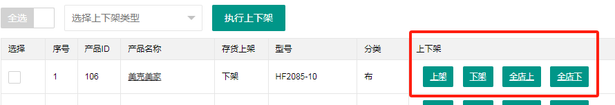

（2）商品批量上架：勾选需要上架的商品，选择上下架类型后，“执行上下架”

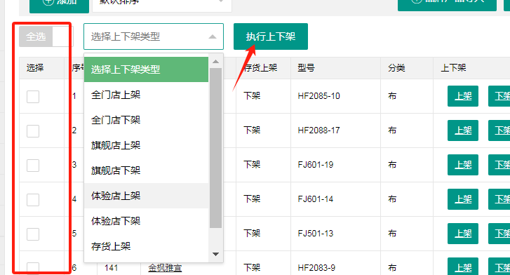

## 2.2 上传商品参数工序

>**商品参数**包括尺寸、重量、材质、功能特性等描述商品特性和规格的具体信息，它们帮助消费者了解商品的详细属性，从而做出购买决策。 
**商品工序**是客户根据自己的需求，选择合适的商品工艺来个性化定制产品，比如侧边工艺的选择，是否贴包布带，有无绑带等。

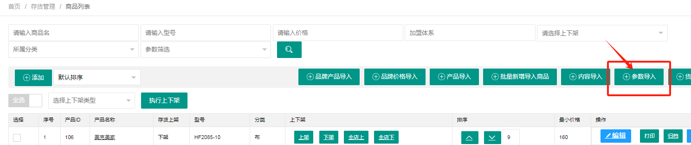

1、商品参数导入参考表：

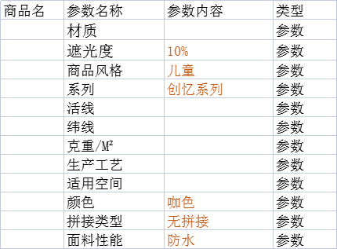

2、商品工序导入参考表：

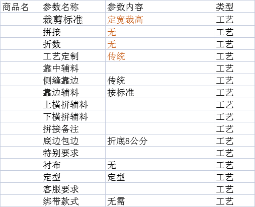

## 2.3 上传物料清单
> **物料清单**指的是成品窗帘需要的原材料详细清单。通过物料清单，企业可以准确地了解到需要哪些原材料。同时，物料清单有助于生产部门获取和使用所需的材料。

通过“**生产管理**”——“**物料清单**”可以通过货号导入物料清单

物料清单导入参考表：

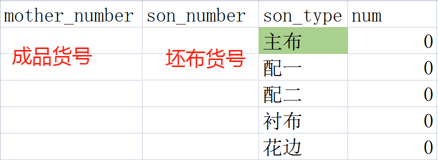

## 2.4 上传客户型号单价

> 某些品牌客户下单的时候，填的是自己品牌坯布的型号，导致系统打印出来流转单后，车间不认识流转单上的坯布对应本司哪个型号。这个时候，就需要系统出手，一一对应，从而将客户的坯布型号，转化成本司的坯布型号。

1、在客户管理——门店管理里，找到要更改型号的门店。

门店详情，把“是否将物料型号更换为本司型号”打开。

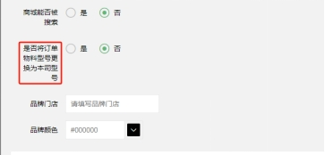 

2、在客户管理——客户型号页面，新建客户型号和本司型号的对应关系，同时可以上传客户的坯布单价。

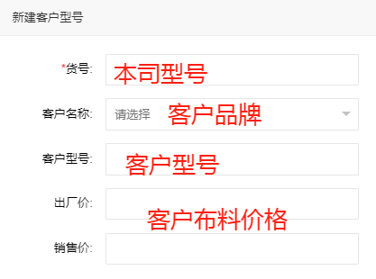

3、客户通过自己的型号下单，订单财务确认后，将自动将客户型号转化为本司型号。
