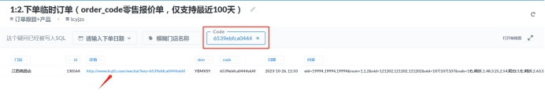

## 1.导入订单方式

### 1.1 一个订单导入
>[!TIP]以下操作适用于需要一次性在一个订单里下单多个商品 

**1.1.1 清空明细并导入窗帘(优先选择)**

(1) 打开“订单列表窗帘导入明细”excel表格

 

(2) 在表格里填入你想要下单的产品名称规格(可以填多行)

***注意***：表格内窗户宽度和成品尺码必填一项；成品高度必填；数量必填；如果主布需要填写宽度用料，“主布货号:用料”，冒号是英文模式下的

(3) 在商城里新建一个订单，下单。

(4) 在后台“销售管理——订单列表”里找到新建的这个订单，点开订单详情，找到“清空明细并导入窗帘”，导入刚刚填写的excel表格。

 

**1.1.2 清空明细并导入商品**

(1) 表格的格式可以在“销售管理——订单列表”里找一个订单，点击“导出明细”，

 

打开是这样的：

 

(2) 然后在表格里填入你想要下单的产品名称规格(可以填多行)

(3) 在商城里新建一个订单，下单。

(4) 然后在后台“订单列表”里找到新建的这个订单，点开订单详情，找到“清空明细并导入商品”，导入刚刚填写的表格。

 

### 1.2 多个订单导入
>[!TIP]以下操作适用于需要一次性导入多个客户的多个订单 

(1) 在订单导入模板内填写需要导入的商品。

(2) **销售管理**——**订单列表**，点击“**订单导入**”按钮

## 2.查看订单进度

(1) 客服收到加盟商反映某个订单出现了问题，可以登录到系统后台，在“财务管理”——“订单列表”里，搜索找到这个订单。

(2) 点击订单右边的“链接”

 

(3) 可以查看到当前订单的两个商品所在的进度。也可以清晰的知道，这个订单是在哪一个环节上出现的问题，方便客服找到该环节的相关人员了解情况。

 

## 3.下单异常

假如客户选好了商品，在购物车页面点了“下单并清空购物车”，但是未提交订单。这个时候购物车里的数据都消失了，客户肯定也不愿意再一个一个把选好的商品再添加回来。

就算客户没提交订单，系统里也会存储客户订单的临时报价单数据。

(1) 询问客户在哪个门店下的单，在系统客户管理——门店管理里，找到这个门店的“设备IMEI号”

 

(2) 在数据库找到”order_code”表，在‘content’字段筛选出包含第一步找到的IMEI号。

 

(3) 根据日期，判断哪一条数据是客户本次的订单，然后复制记录‘code’字段的值。

(4) 在BI里找到“1:2.下单临时订单(order_code零售报价单，仅支持最近100天)”这张表，在code输入框输入刚刚复制的code值。

 

(5) 点击详情链接，出现客户下单但未提交订单的商品数据(相当于回到提交订单页面)。

 

## 4.订单确认

(1) 进入后台，点击“销售管理”---点击“订单列表”

(2) 点击“订单号”

(3) (如果订单需要修改)点击“编辑订单” 

​		点击“编”可以修改商品的尺码等信息

​		点击“配”可以修改商品的配料(主布型号及米数、配  布型号及米数)等信息

(4) 点击“提交支付”

(5) 点击“财务确认”

## 5. 订单详情

**5.1 订单详情中-“订单信息”第二行有 “打印门店”、“打印业主”、“其他项(*\*加工单\**)”**

5.1.1 “打印门店”介绍(涉及到标签打印)

(1) 打印门店不填写：标签里面是默认的门店

(2) 打印门店填写：标签里面是填写的门店

5.1.2 “打印业主”介绍(涉及到标签打印)

(1) 打印门店不填写：标签里面是默认的业主(客户)

(2) 打印门店填写：标签里面是填写的业主(客户)

5.1.3  其他项(***\*加工单\****)介绍(涉及到标签打印及流转单打印)

(1) 其他项选择“加工单”：标签及流转单(工程卡)上显示的品牌会被替换成“加工单”

(2) 其他项不选择“加工单”：标签及流转单(工程卡)上显示默认的品牌

**5.2 “打印链接”介绍**(涉及到水洗唛的二维码)

(1)  订单详情，找到“产品明细”，点击“切换栏目”

(2) 出现“打印连接”，点击对应商品的输入框，输入链接

(3)  输入链接成后 点击“立即确认”

到明细模式里面找到这个 输入链接的产品 点击“水洗唛打印” 出现的二维码进行扫描出现的网页就是这个链接的页面