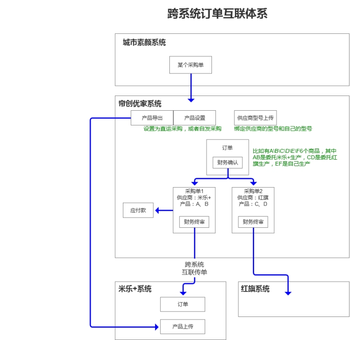
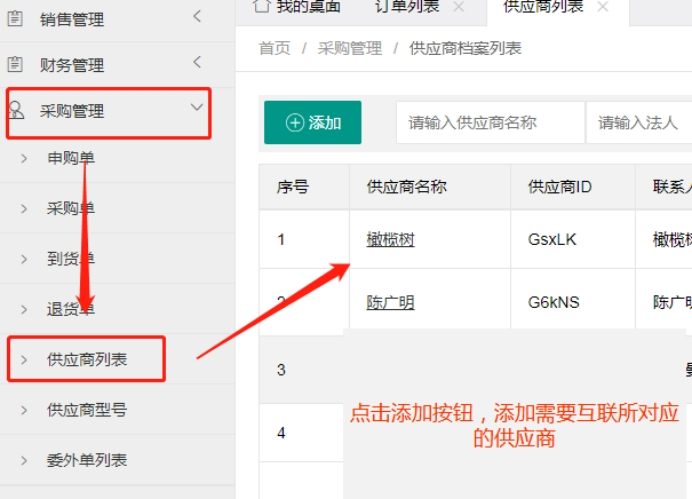
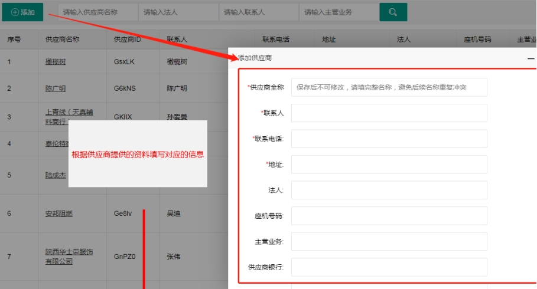
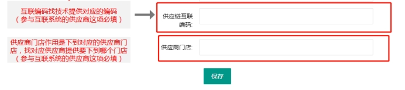
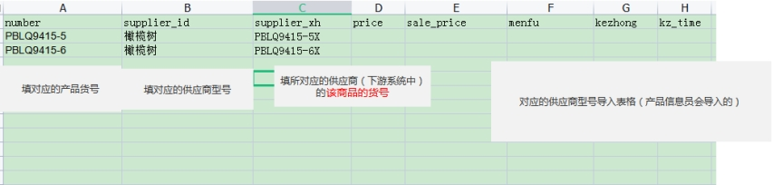
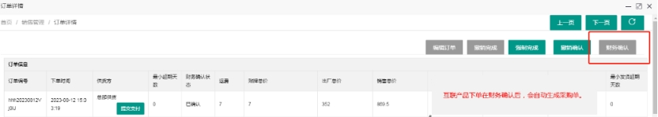
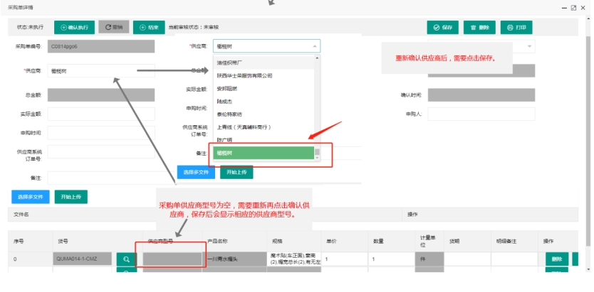
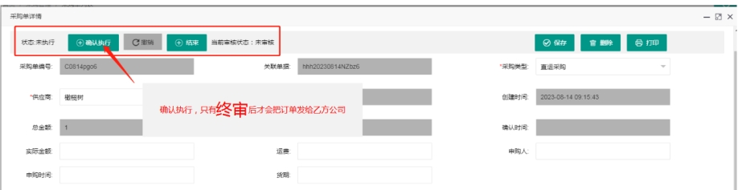

订单互联，举个例子是，客户在a系统的微商城下单了4个商品，其中两个商品自己完成，另外两个商品委托b系统完成。
他们之间的关系就是：a系统是甲方，b系统是乙方。b系统是a系统的供应商。

 

## 1.**乙方**
甲方系统会提供需要互联的商品，乙方系统只要按照商品上传方法，将商品在系统里上传，然后上架。将商品和货号整理成表格，发给甲方系统相关人员。
## 2.**甲方**
### 2.1 供应商列表

2.1.1 在供应商列表添加需要委托加工的供应商。
 

2.1.2 根据供应商提供的资料填写对应的信息。
 

>[!TIP]
(1) 供应商信息的“供应商互联编码”和“供应商门店”必填。 
(2) 供应商门店，决定订单传到乙方系统后，是下在哪个门店里。

 

 
### 2.2 存货档案列表

订单互联，甲方系统需要在系统里上传，需要委托乙方系统加工的商品。
其中商品详情中的，直运采购，和供应商互联按钮 需要打开。

 

### 2.3 供应商型号

>[!TIP]
(1) Number 填甲方系统 上传商品的货号 
(2) Suppler_id 填步骤1在供应商列表里创建的供应商名 
(3) Suppler_xh 填乙方提供的商品货号。

 

## 3.**客户下单**

### 3.1 订单财务确认
互联产品在财务确认后，会自动生成采购单。

 

### 3.2 采购单执行

 

3.3 采购单确认执行，终审后会把订单发到乙方系统里，在乙方系统的订单列表可以看到。

 

 

 