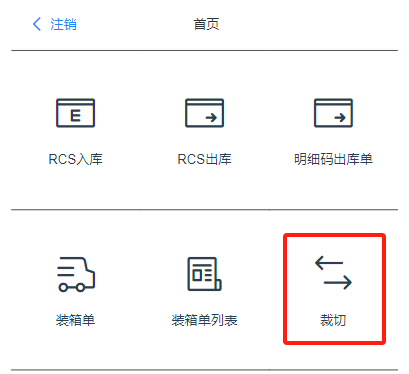

## 2.1 出库导入

**注意：**出库单导入，是直接进行出库操作。不使用PDA做出库操作。
1. 点击“库存管理”，点击“出库单列表”
2. 点击“新建出库库单”
3. 在新建出库单中，点击“导入”，选择相应的模板，进行导入

## 2.2 裁切出库
1. 打开PDA，“**裁切**”app

2. **输入裁切人员工号**，提交后页面会出现当前输入工人姓名

   （这一步，是为了裁剪出库即记件，工人不必再记件，操作出库就有工资了。）

   

3. **扫卷号条码**，

   (1) 点击“**订单**”按钮

   系统会根据输入的卷号自动筛选出所有涉及到该型号的订单，并将所有**未裁切的订单**显示在页面上

   

   (2) 点击“**库存**”按钮

   系统会根据输入的卷号自动筛选出所有涉及到该型号的现存量库存，并显示在页面上。

   

4. **扫明细码**，页面会聚焦到这条明细码对应这一行。

   

5. 在右侧小键盘输入出库米数，点击“**确认裁切**”后，此时系统会将当前输入的米数从库存中扣除，并同时自动记录当前页面工人的记件情况，计算工资。

## 2.3 布料分裁

布料分裁后，系统内这个型号总米数不变。不过(1) 这卷布的原始米数减去分裁米数；(2) 系统增加一卷分裁后的布匹，米数是当前页面分裁米数

## 2.4 疵点报废
在裁剪过程中，可能会遇到坯布存在缺陷或瑕疵，导致某一段坯布不能用于生产，需要被废弃或处理掉的情况。

疵点报废后，系统内这卷布的库存米数减少。

