## 3.1 PDA装箱

**3.1.1  打开PDA，装箱单APP**

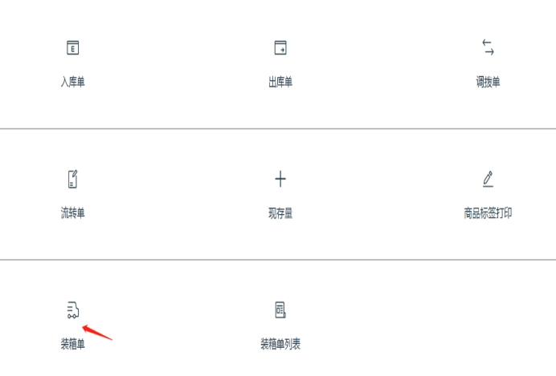 

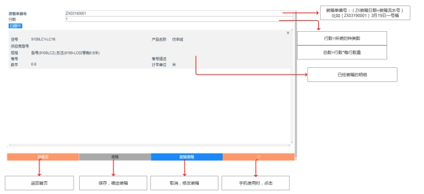 

其中：
(1)装箱单编号：(ZX装箱日期+装箱流水号) 比如(ZX03190001)3月19日一号箱

(2)行数=所装的种类数

(3)总数=行数*每行数量

- 点击保存会显示 
- 点击撤销会显示 
- 删除键：点击删除会显示

**3.1.2 返回首页，打开装箱单列表**
 

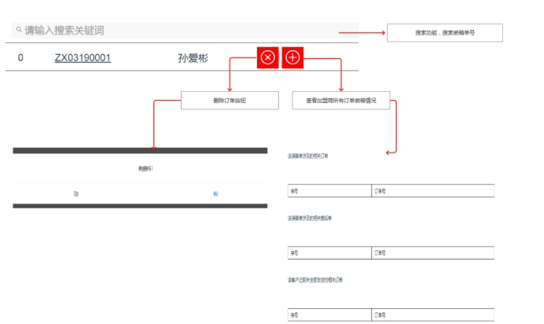                     

(1)搜索功能，搜索装箱单号 
(2)删除订单按钮
 
(3)查看加盟商所有订单装箱情况
 

## 3.2 装箱注意事项 
**(1)不同地址不能一起装箱**
解决方法：找到不同订单的明细，删除此明细，并保存
 

**(2)注意此按钮为手机扫描时用，PDA不要按**
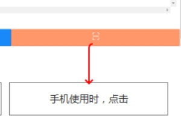 

**(3)当一个订单人需要打包2箱或者更多的箱子时，应当一个箱子建立一张装箱单，分别依次打印出库单，不能只做一个**

**(4)修改已经装箱的订单时会显示，**

 

**(5)“撤销装箱”相当于删除这个装箱单**

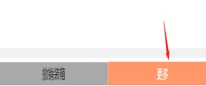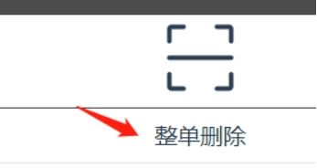 

**(6)新建装箱单，直接在界面中，点击加号按钮，点击确认，注意装箱单要点击装箱再新建**

 

**(7)订单列表——订单详情——切换栏目，可以看到当前订单未装箱数**

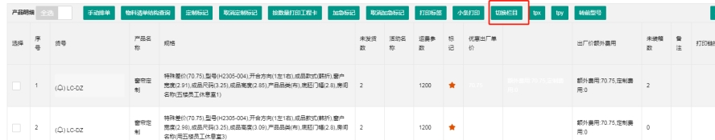 
## 3.3 装箱扫码复审

在【**库存管理**】——【**装箱单明细**】页面

1. 在“**扫码复审**”   输入框输入明细码

2. 若装箱单中有匹配的明细码，那么这条明细码会从“否”变为“是”

3. 依次输入，直到当天所有装箱的明细码都复审完毕。

4. 选择“日期范围”“门店名称”后，一键导出**已复审**后的发货明细表

   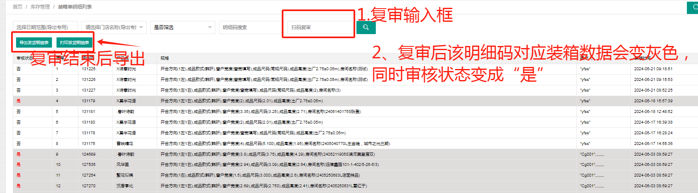

## 3.4 打印快递单

1. 打开网址：http://www.lcyjfz.com/admin/index
进入帘创优家后台，输入仓库账号和密码进入

2. 找到“库存管理”，打开“装箱单列表”

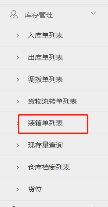 

3. 选择装箱日期为当日，确定按搜索键
 

4. 点击全选，点击打印快递单
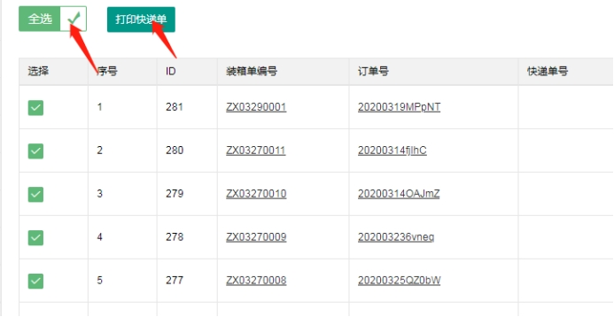 

5. 输入快递重量

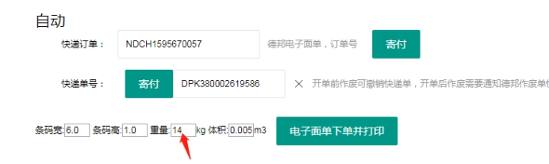 

6. 依次点击“电子面单下单并打印”

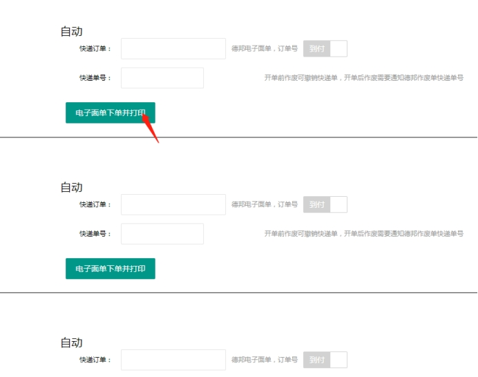 

7. 调整好相关的打印机器，调整纸张大小，选择标签打印机DL-888T打印机，选择纸张尺寸高70mm\*宽130mm

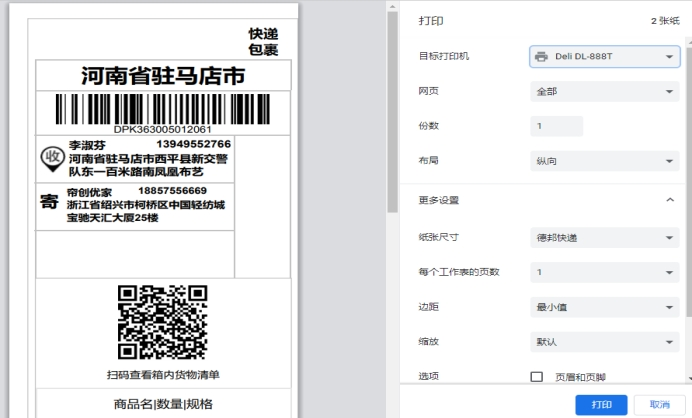 

8. 打印

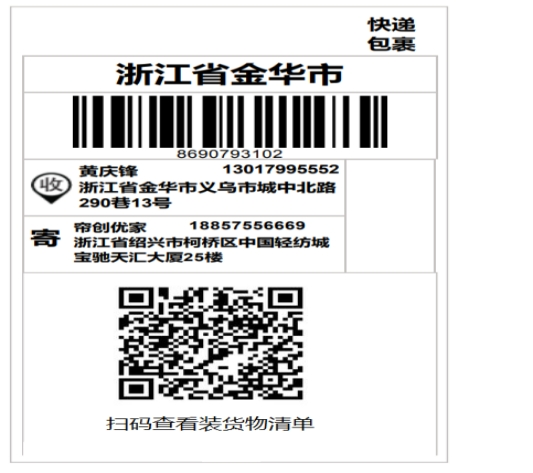 

9. **特殊注意：子母件快递单的打印方法**

(1) 情况一(同一个客户的订单 分多次装箱)：
当同一个订单，有多个包裹时，打印快递单应该复制第一个快递单的“快递订单”号码，如图所示：复制 NDCH1592906747 这串号码，粘贴到其它“快递订单”中，然后点击自动生成快递单号
 

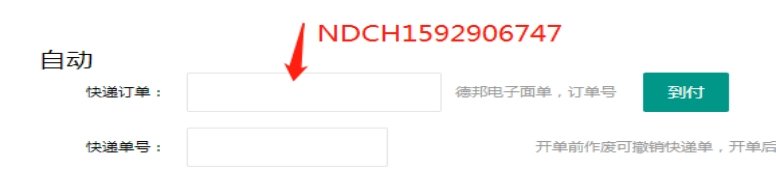 

(2) 情况二(通过PDA创建 子母件装箱单 )：
当同一个订单，要分多次装箱时，可以直接通过PDA的装箱单 进行“创建母件装箱单”操作。打印快递单时，就不需要多次粘贴快递订单号。点击“电子面单下单并打印”，能够将相同的“快递订单(母件号)”自动生产。 如下图所示。
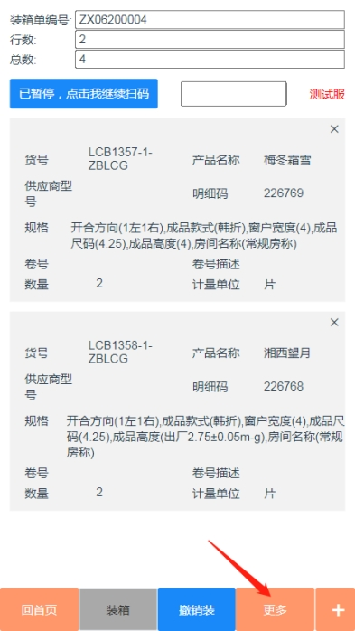 
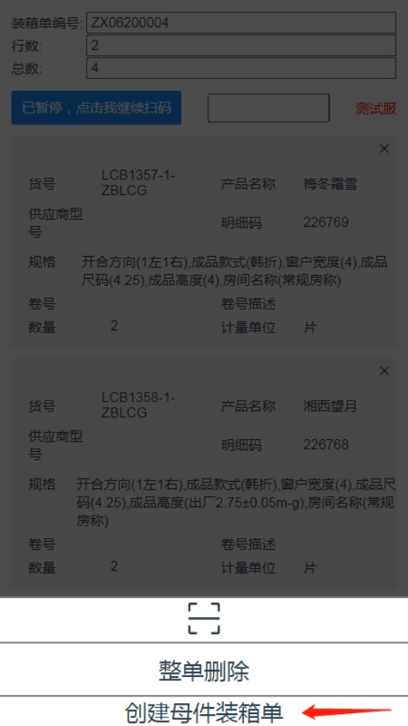 
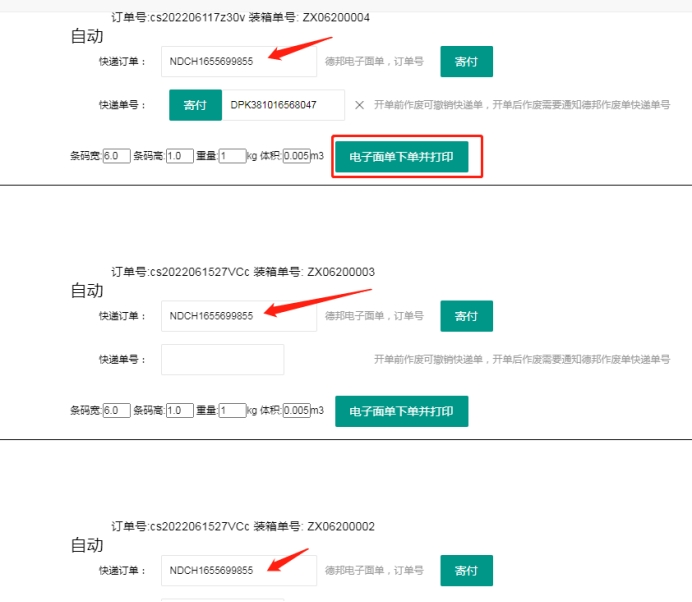