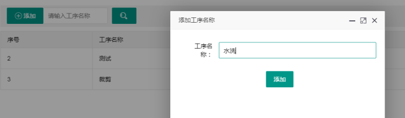
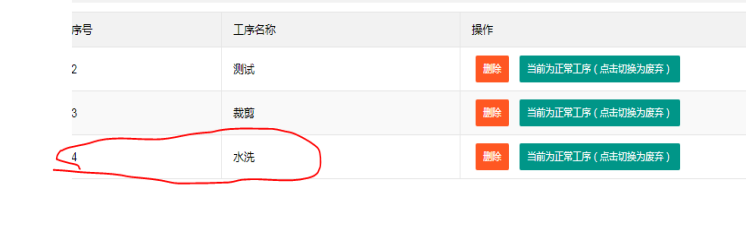
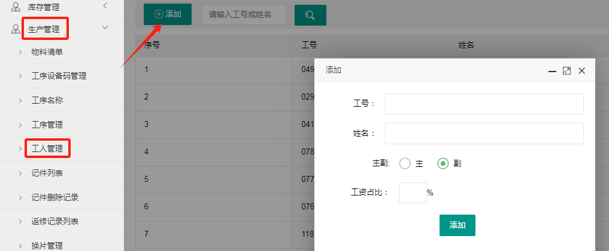
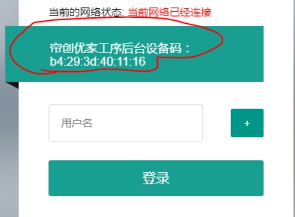
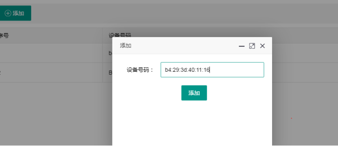
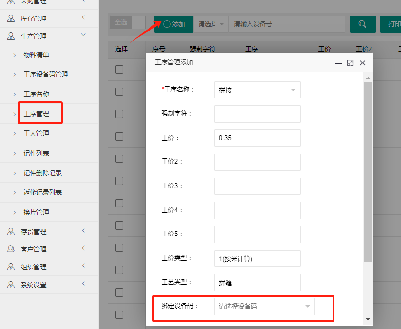

## 3.1 添加工序
点击**“生产管理”**→“**工序名称**”→“添加”，输入新工序名称

## 3.2 添加工人

点击“**生产管理**”→”**工人管理**“→”添加“，输入新工人姓名

## 3.3 绑定平板工序设备码

**1、app下载** 

记件平板联网，用浏览器打开[http://www.lcyjfz.com/upload/apk/lcyj_process_c.apk](http://www.lcyjfz.com/upload/apk/lcyj_process_c.apk)，下载app并按步骤安装。

打开APP 如图 记住设备码

**2、添加设备**

点击“**生产管理**”→“**工序设备码管理**”→“添加”→输入APP中跳出的设备码-----添加保存

**3、绑定平板设备码**

点击“生产管理”→“工序管理”→“添加”→下拉选择工艺→录入工价→工价类型→工艺类型→绑定设备码(选择已保存到系统里的设备码)→添加

