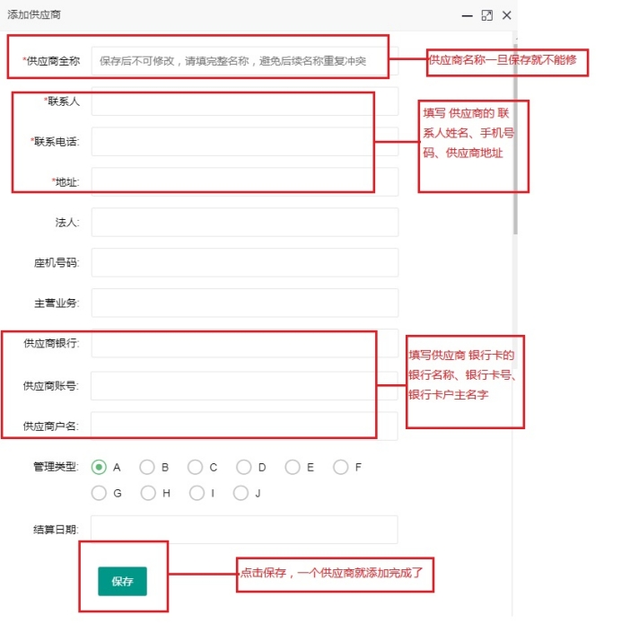
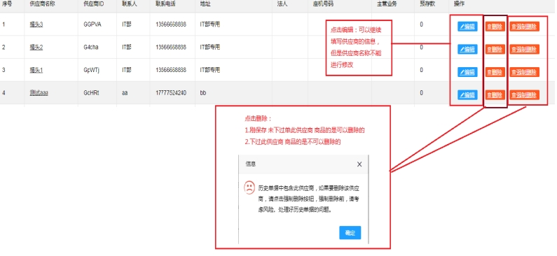
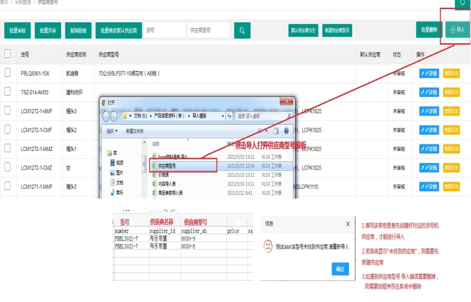

## 4.1 添加供应商

1、点击采购管理------点击供应商列表-----------点击添加

2、 点击编辑可以继续填写供应商的信息，但是供应商全称不能继续修改

3、 点击删除下过此供应商提供的产品是需要强力删除的。刚保存 或未下过此供应商产品的是可以删除的。

## 4.2 上传供应商型号

1、点击采购管理------点击供应商型号------点击导入 (会弹出文件夹 挑选供应商型号的表格进行导入)

2、当导入出现错误时：

（1）填写该表格时首先创建好对应的货号和供应商，才能进行导入

（2）若系统显示“未找到供应商”，则需要先新建供应商

