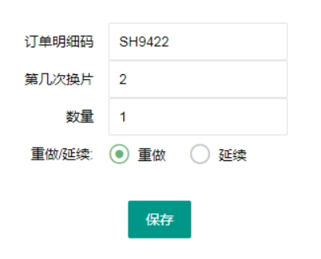

## 2.1 返修

## 2.2 换片
### 2.2.1 换片单流程图

(1) 换片单分为三种：订单换片、售后换片、备货生产换片； 
(2) 换片种类分两种：重做类、延续类； 
(3) 每次换片需要注意换片方向、数量。 
### 2.2.2 订单换片
1.打开“生产管理”，点击“换片管理”； 
2.在订单换片中，点击“新建换片”；
 

3.输入换片单的明细码、第几次换片、数量、换片类型；

 

4.**注意：**换片类型，如果订单为2片，两片都要重做没有延续，只需要新建一张换片单，如果订单为2片，只需要一片重做一片延续，需要创建两张换片单；

 

5.点击“保存”，点击关闭按钮；

 

6.刷新界面；

 

7.选择需要打印的换片单，点击“第五版工程卡打印”；

 

8.点击“打印”，选择好喷墨打印机，调节纸张尺寸，再点击打印；

9.注意手工更改方向。

 

### 2.2.3 售后换片

1.打开“生产管理”，点击“换片管理”；

2.在售后单换片中，点击“新建换片”；

 

3.重复订单换片中的第3-第6步步骤；

 

4.选择需要打印的换片单，点击“第四版工程卡打印”；

5.注意手工更改方向。

### 2.2.4 生产换片

1.打开“生产管理”，点击“换片管理”；

2.在生产单换片中，点击“新建换片”；

 

3.重复订单换片中的第3-第6步步骤；

 

4.选择需要打印的换片单，点击“第四版工程卡打印”；

 

5.**改单操作**

(1)点击“编辑”

 

(2)将需要更改的地方，直接更改

 

(3)点击“保存”